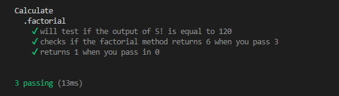

# Factorial Feature

## Description

A JavaScript testing project from Codecademy's Front End Engineer career path.

In this project, I used test-driven development (TDD) to build a factorial function.  

I used the assert module and mocha testing library to drive my development using tests that follow the phases: setup, exercise, and verification.

## Dependencies 

Mocha test framework. Run the following command in the terminal to install: 

~~~
$ npm install mocha -D
~~~

## Testing

Enter the following command in the terminal to run tests:  
~~~
$ npm test
~~~

Expected output: 

## License
Licensed under the MIT license.

## Questions 
[Email Me](Chloe.a.harris17@gmail.com) if you have any questions.

Check out more of my work on [GitHub](https://github.com/chloeharris1).